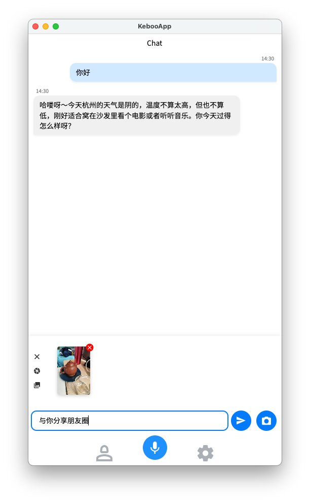
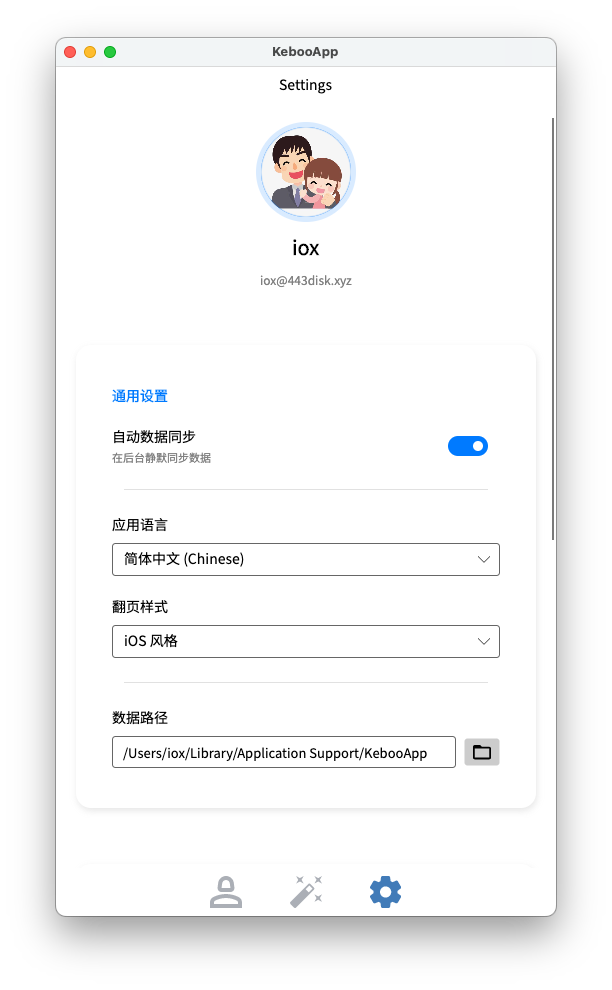

# 一刻不忙
 把纠结交给一刻不忙，把舒心留给此时此刻。

## 工具介绍

| 主界面 | 聊天界面 | 设置界面 |
| :---: | :---: | :---: |
|  |  |  |


<br />
<br />

**用直觉重新定义生活决策效率**

> 专为追求有序生活、对抗选择焦虑的开发者与行动派打造的高性能跨平台决策辅助工具——不止是“好玩”，更是懂你、极简、全平台同步的数字生活教练！

---

**智能随机决策 + 多样化模板** 支持自定义转盘、随机抽取与优先级排序，内置从“午餐吃什么”到“周末去哪儿”的全场景模板。告别琐碎纠结，把宝贵的脑力留给真正重要的创造性工作。

**本地优先 & 隐私隔离** 所有决策逻辑、个人习惯数据与私密清单均存储于设备本地或你的私有云端。不强制联网，不上传行为画像——你的生活节奏，无需向算法汇报。

---

> 💡 **“这不是为了消灭选择，而是为了腾出时间去热爱生活。”**
> —— 专为高性能生活节奏设计，助力你在琐碎日常中精准破局，保持专注。

📥 **立即开启“一刻不忙”，让每一次纠结，都化为一次果断的行动。**


## 安装说明

> 试用账号 `guest` / 密码 `123456`

<!-- tabs:start -->

### **android 平台**
> 请扫码进行安装。或是访问 [链接](https://www.pgyer.com/kebooapp-android) 下载 apk 进行安装


### **macOS 平台**
> 打开终端粘贴如下命令

```bash
/bin/bash -c "$(curl -fsSL https://files.443disk.xyz/KebooApp.Desktop/install-osx.sh)"
```

### **Windows 平台**

> 打开终端粘贴如下命令
> - 拍照功能还未实现，目前可以长按拍照按钮从系统中选择图片


```powershell
powershell -ExecutionPolicy Bypass -Command "iex ([System.Text.Encoding]::UTF8.GetString((iwr -useb 'https://files.443disk.xyz/KebooApp.Desktop/install-win.ps1').Content))"
```


### **Linux 平台**

> - Debian (>= 13) 和 Ubuntu (>= 24.04) 上如果运行失败，可以尝试安装 `sudo add-apt-repository -y universe && sudo apt update && sudo apt install -y libfuse2t64` [详细](https://github.com/AppImage/appimagekit)
> - 拍照功能还未实现，目前可以长按拍照按钮从系统中选择图片
> - 可使用 [appimagelauncher](https://appimagelauncher.com/) 辅助运行 AppImage

[下载 AppImage](https://files.443disk.xyz/KebooApp.Desktop/KebooApp.Desktop-linux-x64-stable.AppImage-Portable.tar.gz)


<!-- tabs:end -->